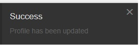
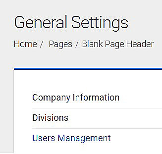

# Account Settings 

## Profile Page

The profile page in the <strong>AC Tajanlangit System</strong> lets the you manage your account information, view assigned projects, view assigned roles and view recent activities. 

### <u>Navigating to the Profile Page</u>

1. Log in to the <strong>AC Tajanlangit System</strong> using your registered email and password. Once you have successfully logged in, you will see the dashboard page.

2. On the dashboard page, click on the `Profile Settings` button in the <b>icon controllers</b> on the upper left corner of the dashboard. 

    

3. A message box will appear below the `Profile Settings` button. The message box contains the following:

<table>
    <tr>
        <td width="200px">
            

                
            

        </td>
         <td>
        <ol type="i">
            <li><b>User Name</b> - Shows the name of the current user logged in.</li> 
            <li><b>Availability Status</b> - Shows if the user is available or offline.</li> 
            <li><b>Account Settings</b> - Access to the Profile Settings of the user.</li> 
            <li><b>Logout button</b> - Access to exit to the system.</li> 
        </ol>
    </td>
    </tr>
</table>

4. Click on the `Account` button to proceed to the `Profile Settings` Page.

<strong>You have successfully accessed to the `Profile Settings` page!</strong>

### <ins>Three Sections in the Profile Settings Page</ins>

<table width="750px" align="center">
    <tr>
        <td width="200px">
            
        </td>
        <td width="330px">
        

                <h4><b>I. User Profile Information</b></h4>
            <ol type="1">
                <li>Username</li>
                <li>Job Title</li>
                <li>Profile Picture</li>
                <li>Profile Information</li>
                <li>Credentials</li>
                <li>Roles</li>
            </ol>
         
        

        
<b>II. Projects</b> - It contains the list of projects the user is currently assigned to and the project's last update record.

        
        </td>
        <td width="330px">
            
            

             
<b>III. Recent Activities</b> - It contains the list of activities done in the system per project. It shows the date and time of activity and details of the activity done.

        </td>
    </tr>
</table>

The features of the `Profile Settings` page will depend on the <b>role of a user</b>. The features of the Profile Settings page are:

- Edit account information - This feature can be accessed by all users
- Change security credentials - This feature can be accessed by all users.
- Uploading profile picture - This feature can be accesssed by all users.
- Assigning roles to a user - This feature can only be accessed by an admin. 

## Editing Account Information- All users

Editing the account information in the profile page can be accessed by all users. To edit your account inforamtion, go to the Profile Settings Page, navigate to the <b>Profile Information</b> located at the left side of the Profile Page below the profile picture.

<table align="center">
    <tr>
        <td>
            
        </td>
        <td>
            
 In the <b>Profile Information panel</b>, you can be able to edit the following details:

            <ul type="square">
                <li>First Name</li>
                <li>Last Name</li>
                <li>Email Address</li>
                <li>Position</li>
            </ul>
        </td>
    </tr>
</table>

To edit the following profile details:

1. Click on the pencil icon located beside the labels `First Name`, `Last Name`, `Email Address` and `Position`. 

2. Click on the text box and begin updating the information. 

3. Click on the `Save` button to save or click on the `Cancel` to cancel the changes. 

<table border="0">
    <tr>
        <td>
            
        </td>
        <td width="300px">
            <ul>
                <li> Click on the pencil icon located beside the labels `First Name`, `Last Name`, `Email Address` and `Position`. </li>
                

            </ul>
        </td>
    </tr>
    <tr>
       <td width="300px">
            <ul>
                

                <li>Click on the text box and begin updating the information.</li>
                <li> Click on the `Save` button to save or click on the `Cancel` to cancel the changes. </li>
            </ul>
        </td>
        <td>
            
        </td>
    </tr>
</table>
 
Do the same steps for the rest of the profile information details. Updating the details in the profile information panel should be done <b>one profile detail at a time</b>. In order to save changes you have to click the `Save` button. 

A pop notification will appear on the window to signify that the changes was successfully been saved.

&nbsp;

## Changing Security Credentials in the Profile Page - All users

Changing the security credentials can be accessed by all users. The security credentials contains the password used to access the system in the Log in page. 

In the <b>AC Tajanlangit System</b> the features of the profile security credentials are the following:

- <b>Reset password</b> - This is a feature where the password can be changed or updated to a new password.

- <b>Resend password</b> - This is a feature where the user can be able to resend their exisiting password to their email address without changing or updating their password. 

### <u>How to Reset Password?</u>

To reset the password go to the `Profile Settings` page. Navigate to the `Credentials` panel on the left side of the window below the `Profile Information`. In the `Credentials` panel it contains the current password which is encrypted in asterisk `*`.  

1. Click the pencil icon beside the encrypted password to begin updating the password.

2. Two textboxes: `Password` and `Confirm Password` and two buttons `Save` and `Cancel` wlll appear in the `Credentials` panel. 

3. Type in the new password inside the textbox labeled as: `Password`. 

4. Re-type the new password inside the textbox labeled as : `Confirm Password` to check if both passwords are a match. 

5. Click on the `Save` button to save changes.

6. The log in page will appear. Re-log in using the new password to enter back to the system.

<table align="center">
    <tr>
        <td width="250px">
            
        </td>
        <td>
            
1. Click the pencil icon beside the encrypted password to begin updating the password.
            

        </td>
    </tr>
    <tr>
        <td width="250px">
            
        </td>
        <td>
            
2. Textboxes: <b>Password</b> and <b>Confirm Password</b> and two buttons `Save` and `Cancel` wlll appear in the `Credentials` panel.

            
3. Type in the new password inside the textbox labeled as: `Password`. 
 
            

        </td>
    </tr>
    <tr>
        <td width="250px">
            
        </td>
        <td>
              
            
4. Re-type the new password inside the textbox labeled as : `Confirm Password` to check if both passwords are a match. 

            
5. Click on the `Save` button to save changes.

            

            6. The log in page will appear. Re-log in using the new password to enter back to the system.
        </td>
    </tr>
</table>

### <u>How to Resend Password?</u>

1. Go to the `Profile Settings` page.

2. Navigate to the `Credentials` section on the left side of the page.

3. Click the `Resend Password` button.

4. A notificaton will appear at the right side of the page to confirm.

5. An email will be sent with your password. 

<table>
    <tr>
        <td>
            
1. Go to the `Profile Settings` page.

            
2. Navigate to the `Credentials` section on the left side of the page.

            

        </td>
        <td width="250px">
            
        </td>
    </tr>
    <tr>
        <td>
            
3. Click the `Resend Password` button.

            

            
4. A notificaton will appear at the right side of the page to confirm.

            
5. An email will be sent with your password. 

        </td>
       <td width="250px">
            
        </td>
    </tr>
</table>

## Uploading Profile Pictures - All users

In uploading a profile picture in the `Profile Settings` page. Locate to upper left side of the profile page. An avatar enclosed inside a box is where the profile picture will be uploaded and be displayed.

    

There are two ways on how you can upload your profile picture in the `Profile Settings` page:

### <ins>Click and Select</ins>

1. Click on the avatar.

2. Select a picture from your local folder directory.

3. Click the `Open` button.

You have successfuly updated your profile picture.

### <ins>Drag and Drop<ins>

1. Go to your local folder directory where your picture is located.

2. Drag the picture from your local folder directory.

3. Drop the picture inside the avatar box.

You have successfully updated your profile picture.

&nbsp;

## Assigning Roles to a User - Admin

Assigning roles to a user requires the user to be assigned in an admin role. This feature allows you to do the following:

### <ins>Assigning roles to self</ins>

This feature allows you to edit or add roles to your own profile settings. Here are the steps:

1. Go to the Profile Settings Page.

2. Scroll down and locate the `Roles` Section.

3. Click on the textbox with the label `Select Role`.

4. Select from the dropdown menu the role to be assigned to your account.

5. Click the `Add` button beside the textbox.

<table border="1">
    <tr>
        <td width="250px">
            
        </td>
        <td>
            
1. Go to the Profile Settings Page.

            
2. Scroll down and locate the `Roles` Section.

            

        </td>
    </tr>
    <tr>
        <td width="250px">
            
        </td>
        <td>
            
3. Click on the textbox with the label `Select Role`.

            
4. Select from the dropdown menu the role to be assigned to your account.

            
5. Click the `Add` button beside the textbox.

        </td>
    </tr>
</table>

<strong>You have successfully assigned a new role to your own personal profile. You will receive a message in your email to notify the changes made.</strong>

&nbsp;

### <ins>Assigning roles to a user</ins>

This feature allows you to edit or add roles to a different user. Here are the steps:

1. Go to the dashboard page.

2. Click the `General Settings` button in the `icon controllers` on the upper right corner of the dashboard.

3. In the `General Settings` page, select the `User Management` on the left side panel of the page.

4. Search or select the user.

5. In the `Profile Settings Page` scroll down to locate the `Roles` section.

6. Click on the textbox with the label `Select Role`.

7. Select from the dropdown menu the role to be assigned to the user.

8. Click the `Add` button beside the textbox.

<table border="1" align="center">
    <tr>
        <td width="250px">
            
        </td>
        <td>
            
1. Go to the dashboard page.

            
2. Click the <b>General Settings</b> button in the <b>icon controllers</b> on the upper right corner of the dashboard.

            

        </td>
    </tr>
    <tr>
        <td width="250px">
            
        </td>
        <td>
            
3. In the <b>General Settings</b> page, select the <b>User Management<b> on the left side panel of the page.

            

        </td>
    </tr>
</table>

&nbsp;

<table broder="1">
    <tr rowspan="3">
    

    <td>4. Search a user to edit. Once found select the user by clicking on the full name beside the user's avatar.</td>
    <td></td>
    </tr>
    <tr>
        <td colspan="2"></td>
    </tr>
</table>

<table border="1">
    <tr>
        <td width="250px">
            
        </td>
        <td>
            
  5. In the `Profile Settings Page` scroll down to locate the `Roles` section.

            
6. Click on the textbox with the label `Select Role`.

            

        </td>
    </tr>
    <tr>
        <td width="250px">
            
        </td>
        <td>
            
7. Select from the dropdown menu the role to be assigned to the user.

            
8. Click the `Add` button beside the textbox.

        </td>
    </tr>
</table>

<b>You have successfully assigned a new role to a user. The user will receive a message in their email to notify the changes made.</b>

