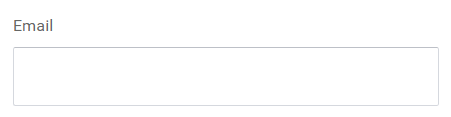
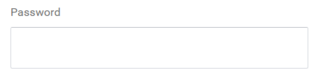
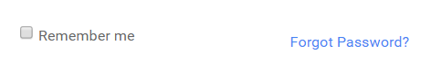

# Authentication

## <ins>Log in Page</ins>

Welcome to the <b>`AC Tajanlangit System`</b>!

Using the `AC Tajanlangit System` requires you to log in using the URL: `http://actajanlangit.herokuapp.com` with the following credentials:

- Email address

- Password

 The credentials are created by the assigned <b>admin</b> base on <b>role assignment</b>. 

 

 <ins>`Unregistered Users`</ins>

 - For <b>unregistered users</b> you may send an email request to the assigned <b>admin</b> for registration.

 - The <b>admin</b> will create your account with your requested log in credentials: `email` and `password`. 
 
 - Once confirmed by the <b>admin</b> you will receive an email message confirming your registration. 
 
 - Then, access the URL: `http://actajanlangit.herokuapp.com` to log in.

    

 - Type in your `registered email` inside the `textbox` below the text label: `Email`. 

    
 
 - Then, type in your `registered password` inside the `textbox` below the text label: `Password`. 

    

 - Click on the `Sign me in` button to enter the application.
 
    

    

<ins>`Registered Users`</ins>

- For <b>registered users</b> you may access the application using the URL : `http://actajanlangit.herokuapp.com` .

- Type in your `registered email` inside the `textbox` below the text label: `Email`.

    

 - Then, type in your `registered password` inside the `textbox` below the text label: `Password`. 

    
 
- Click on the `Sign me in` button to enter the application.

    

<strong>Other buttons on the `Log in Page` are the following:</strong>

- `Remember Me` -  is a checkbox feature where the application will remember your sign in credentials for future log in.

- `Forgot Password?` - is a hyperlink feature where you can reset your password to get a new password. 

    

## <ins>Admin and Non-Admin Role </ins>

 `Admin and Non-admin roles` have different access to the features of the application. However, a single <b>user</b> can have <strong>multiple roles</strong> in the application.

### User Authentication Feature - Admin Role

<ins>`Admin Role`</ins>

- The `admin` is also known as the <strong>super admin</strong>. The <b>super admin</b> has access to all features of the application. The <b>super admin</b> is also in charge with the registration of users to gain access to the application.

- In the `User Authentication feature` the <b>admin</b> has access to the following:

    <b>`Super Admin Features - User Authentication Feature`</b>
        
    - Create Users
    - View list of Users
    - Assign role for users.
    - Assign permission to users.
    - Suspend users.
    - View list of suspended users.
    - Edit user details
    - View user details
    - Change credentials/password of users.

### User Authentication Feature - Non-Admin Role

<ins>`Non-Admin Role`</ins>

- The <b>non-admin</b> is the <strong>user</strong> who has limited access to the feature of the application.

- In the `User Authentication feature` the <b>non-admin</b> has access to the following:

    `Non-Admin (user) Features - User Authentication Feature`

    - View their personal profile
    - Update their personal profile

## <ins>Job Roles</ins>

There are different `job roles` in using the application. Job roles have specific `role assignment per feature` to the system. Below are the different `role assignment per feature`.

1. <b>`Cost Engineer`</b> - The role of the `Cost Engineer` is to estimate the cost of projects, analyze requirements and specification of a project, and determine the cost involved to execute such project. In the `AC Tajanlangit system` the role assignment feature of a `Cost Engineer`is as follows:
    
    - View details of material scopes and schedules
    - Create material items schedules
    - Submit material items schedules for approval
    - Create job Order
    - Create billing for accounting
    - View gantt chart

2. <b>`Planner`</b> - The role of a `Planner` is to develop a plan to complete a project based on budget, work schedule, and available resources. In the `AC Tajanlangit system` the role assignment feature of a `Planner` is as follows:

    - Submit material scopes and schedules for approval
    - Upload material scopes and schedules 

3. <b> `Purchasing Officer`</b> - The role of a `Purchasing officer` is to research on potential vendors, compare and evaluate offers from suppliers, and negotiate contract terms of agreement and pricing. In the `AC Tajanlangit system` the role assignment feature of a  `Purchasing officer`> is as follows:

    - Submit purchase request for approval 
    - Create purchase orders from purchase request
    - Create service purchase order from job order
    - View list of all purchase orders
    - View list of all service purchase orders
    - Edit purchase order
    - View list of purchase requests
    - Edit purchase request

4. <b>`Warehouse Man`</b> - The role of a `Warehouse man` is to receive and process incoming stocks and materials, picking and filing orders from stock, packing and shipping orders, and managing stock in the warehouse. In the `AC Tajanlangit system` the role assignment feature of a `Warehouse man` is as follows: 

    - View list of approved and incoming purchase orders
    - Check and note received items from purchase order document.

5. <b>`Accounting`</b> - The role of `Accounting` is responsible for the general ledger, job cost, bank reconciliations and accounts payable. In the `AC Tajanlangit system` the role assignment feature of the `Accounting` is as follows:

    - View list of purchase orders
    - View details of a service purchase order
    - Mark service purchase order as completed
    - View list of purchase orders 
    - View details of a purchase order
    - Mark purchase order as completed
    - View list of billings
    - View details of billings
    - Confirm billings from Cost Engineer
    - Leave remarks to Service Purchase orders
    - Leave remarks to Billings

6. <b>`Project Manager`</b> - The role of a `Project Manger` is with the planning and the execution of a particular project. In the `AC Tajanlangit system` the role assignment feature of the `Project Manger` is as follows:

    - Request approval for changes of activity duration, start and finish
    - Ability to check purchase request
    - List of purchase requests
    - View details of purchase request
