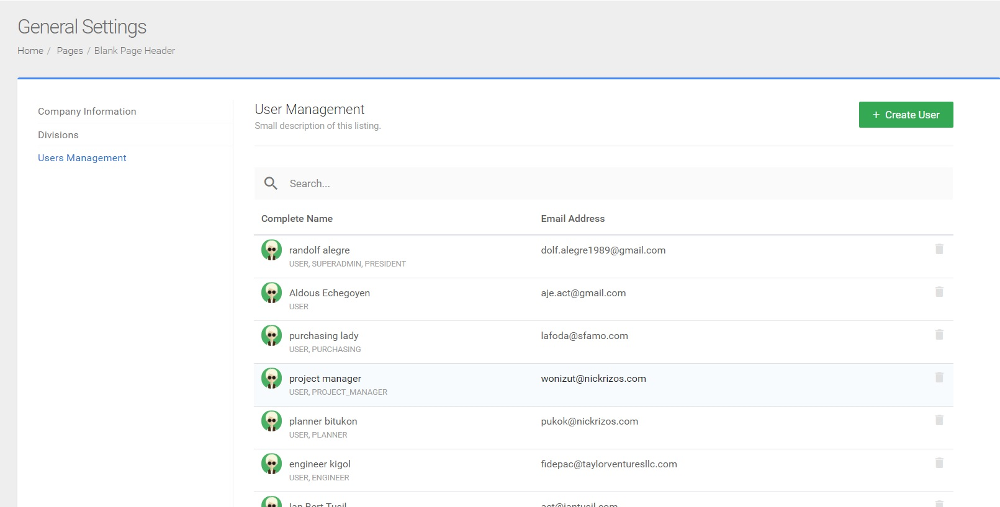

# General Settings 

The general settings page can only be accessed if the user is assigned to an `admin` role. Non-admin users will not be able to see the `General Settings` in the icon controllers of the dashboard. 

Here are the features of the general settings:

- Create and Manage User Accounts - Admin
- Create and Manage Divisions - Admin
- Manage Company Information - Admin

To access the `General Settings` page:

1. Log in using your register `email` and `password`.

2. Locate to the icon controllers at the upper right corner of the dashboard.

3. Select the `General Settings` icon.

<table align="center">
    <tr>
        <td width="200px">
            
1. Log in using your register <b>Email</b> and <b>Password</b>.

        </td>
        <td>
            
        </td>
    <tr>
        <td>
            
2. Locate to the icon controllers at the upper right corner of the dashboard.

            
3. Select the `General Settings` icon.

        </td>
        <td>
            
        </td>
        <tr align="center">
            <td colspan="2">
            
The <b>General Settings</b> page will appear on the interactive section of the dashboard.

            </td>
        </tr>
    </tr>
    <tr>
        <td colspan="2">
            
        </td>
    </tr>
</table>

The `General Settings` is divided to two sections:

- Navigation Links - This section contains the following:

    - Header - The header section is composed of the name of the page `General Settings` and the links `Home / Pages / Blank Page Header`.  

    - Left Panel - The left panel comprise the navigation links `Company Information`, `Divisions`, and `User Management`.

- Content Section - This section is the interactive part of the `General Settings`. It contains the input controls of each navigation links on the left panel section of the page.

&nbsp;

## General Settings - Creating and Managing User Accounts (Admin)

Creating and managing user accounts is one of the features in the `General Settings` page. This feature allows the user admin to create a new user in the system and edit the user account information in the user's profile page.

    

### <ins>Create User</ins>

1. Go to the `General Settings` page.

2. Select `User Management` on the left panel of the `General Settings` page.

The `User Management` page will appear in the content section.

3. Click the `+ Create User` button on the upper right corner of the content section.

The `New User Form` will appear in the User Management page.

4. Enter the required details in each textboxes labeled as `First Name`, `Last Name`, `Email Address`, `Position`, `Password`, and `Confirm Password`.

5. Click the `Save User` button to save the changes made or click the `Cancel` button to disregard changes made.

<table>
    <td>
        
    </td>
    <td>
        
1. Go to the General Settings page.

        
2. Select User Management on the left panel of the General Settings page.

        
The User Management page will appear in the content section.

    </td>
    </tr>
        <tr>
        <td colspan="2">
           
3. Click the <b> + Create User</b> button on the upper right corner of the content section.

           
The <b>New User Form</b> will appear in the User Management page.

        </td>
    </tr>
    <tr>
        <td colspan="2">
            
        </td>
    </tr>
    <tr>
          <td colspan="2">
            
4. Enter the required details in each textboxes labeled as First Name, Last Name, Email Address, Position, Password, and Confirm Password.

        </td>
    </tr>
    <tr>
        <td width="150px">
            
5. Click the <b>Save User</b> button to save the changes made or click the <b>Cancel</b> button to disregard changes made.

        </td>
        <td>
            
        </td>
    </tr>
</table>

To check if the user has been successfully added in the system, scroll to the user management or use the search box to locate the new user added. 

NOTE: Only an `admin` role has access to this feature.

&nbsp;

### <ins>Manage User Account </ins>  

1. Go to the `General Settings` page.
2. Select `User Management` on the left panel of the `General Settings` page.

The `User Management` page will come to view in the content section.

3. Select a user to edit in the list of users in the `User management`. 

You may use the scroll bar or use the search box to find the user. The profile page of the user will appear on top of the dashboard.

4. Edit the account of the user selected.

<table>
    <tr>
        <td>
            
        </td>
        <td>
            
1. Go to the General Settings page.

            
2. Select User Management on the left panel of the General Settings page.

            
The User Management page will appear in the content section.

        </td>
    </tr>
    </tr>
        <tr>
        <td colspan="2">
           
3. Select a user to edit in the list of users in the User management. 

           You may use the scroll bar or use the search box to find the user. The profile page of the user will appear on top of the dashboard.
            
4. Edit the account of the user selected in the user's profile page.

        </td>
    </tr>
    <tr>
        <td colspan="2" align="center">
            
        </td>
    </tr>
</table>

For every changes made to the user a pop notification will appear at the right side of the window. The user will receive an email notification for the changes made.

NOTE: Only an `admin` role has access to this feature.

## General Settings - Creating and Managing Divisions (Admin)

Creating and Managing Divisions can be accessed in the `General Settings` page. This feature allows the user admin to add missed division assigned to a project or create a new division to the system. 

NOTE: Be careful when modifiying the divisions. Changes to the divisions will reflect to all of the documents and records.

### <ins>Create Divisions</ins>

1. Go to the `General Settings` page.

2. Select `Divisions` on the left panel of the `General Settings` page.

The `New Division Form` will come to view in the content section of the `General Settings` page.

3. Click the `+ Create Division` button in the content section.

4. Fill in the details for the new division inside each textboxes with labels `Code` and `Division name`.

5. Click the `Save User` button to save the changes or click the `Cancel` button to disregard changes.

<table>
    <tr>
        <td>
            
        </td>
        <td>
           
1. Go to the `General Settings` page.

            
2. Select `Divisions` on the left panel of the `General Settings` page.

            
The `New Division Form` will come to view in the content section of the `General Settings` page.

        </td>
    </tr>
       <tr>
        <td colspan="2">
           3. Click the <b>+ Create Division button</b>  in the content section.
    </tr>
    <tr>
        <td colspan="2">
                    
        </td>
    </tr>
    <tr>
        <td width="200px">
            
4. Fill in the details for the new division inside each textboxes with labels <b>Code</b> and <b>Division name</b>.

            
5. Click the <b>Save User</b> button to save the changes or click the <b>Cancel</b> button to disregard changes.

        </td>
        <td>
               
        </td>
    </tr>
</table>

A pop up notification will appear at the right side of the page once the changes has been saved. 

Check the `Division management` page, if the division was successfully added. Scroll to the list of divisions using the scroll bar or use the search box to narrow the search of the division.

<table align="center">
    <tr>
        <td width="300px">
            
NOTE: The <b>Division Code</b> is a unique identifier that distinctly identifies a division to other divisions. <b>Duplicate division code is not allowed.</b> If the division code has been deleted, <b>it cannot be reused.</b> An error message will appear on the upper right corner of the page to notify `Duplicate code error`.

        </td>
        <td>
            
        </td>
    </tr>
</table>

&nbsp;

### <ins>Manage Divisions</ins>

Managing divisions lets you do the following:

- Delete a division
- Rename a division.

To delete a division:

1. Go to the `General Settings` page.

2. Select `Divisions` on the left panel of the `General Settings` page.

The `Division Management` will appear on the content section. Use the scroll bar or use the search box to find the division.

3. Select a division to delete. 
4. Click the delete button on the right side beside the `Division Name`.

A pop up confirmation message will appear on top of the page.

5. Click the `OK` button to delete the division or click the `Nevermind` button to cancel the delete action.

A pop up notificaiton will appear at the right side of the page to indicated that the division has been removed.

<table align="center">
     <tr>
        <td>
            
        </td>
        <td>
           
1. Go to the <b>General Settings</b> page.

            
2. Select <b>Divisions</b> on the left panel of the <b>General Settings</b> page.

            
The <b>Division Management</b> will appear on the content section. Use the scroll bar or use the search box to find the division.

        </td>
    </tr>
        <tr>
        <td colspan="2">
          
3. Select a division to delete.
 
        
4. Click the delete button  on the right side beside the <b>Division Name</b>.

    </tr>
    <tr>
        <td colspan="2">
                    
        </td>
    </tr>
    <tr>
        <td>
            
A pop up confirmation message will appear on top of the page.

            
5. Click the <b>OK</b> button to delete the division or click the <b>Nevermind</b> button to cancel the delete action.

        </td>
        <td>
             
        </td>
    </tr>
    <tr>
        <td>
            
A pop up notificaiton will appear at the right side of the page to indicated that the division has been removed.

        </td>
        <td>
            
        </td>
    </tr>
</table>

Check the `Division management` page, if the division was successfully deleted. Scroll to the list of divisions using the scroll bar or use the search box to narrow the search of the division.

&nbsp;

To rename a division:

1. Go to the `General Settings` page.

2. Select `Divisions` on the left panel of the `General Settings` page.

The `Division Management` will appear in the content section. Use the scroll bar or use the search box to find the division.

3. Select a division to edit by using the search box or use the scroll bar to scroll through the list of divisions.
4. Click the pencil icon beside the `Division Name`.
5. Click the textbox labeled as `Division Name` to rename.
6. Click the `Save` button to save changes or click the cancel to disregard changes made.

<table>
   <tr>
        <td>
            
        </td>
        <td>
           
1. Go to the <b>General Settings</b> page.

            
2. Select <b>Divisions</b> on the left panel of the <b>General Settings</b> page.

            
The <b>Division Management</b> will appear on the content section. Use the scroll bar or use the search box to find the division.

        </td>
    </tr>
    <tr>
        <td colspan="2">
            
3. Select a division to edit by using the search box or use the scroll bar to scroll through the list of divisions.

            
4. Click the pencil icon  beside the <b>Division Name</b>.

        </td>
    </tr>
    <tr>
        <td colspan="2">
            
        </td>
    </tr>
    <tr>
        <td width="200px">
            
5. Click the textbox labeled as <b>Division Name</b> to rename.

            
6. Click the `Save` button to save changes or click the cancel to disregard changes made.

        </td>
        <td>
            
        </td>
    </tr>
</table>

Check the `Division management` page, if the division was successfully edited. Scroll to the list of divisions using the scroll bar or use the search box to narrow the search of the division.

&nbsp;

## General Settings - Manage Company Information (Admin)

Managing company information is the other feature in the `General Settings` page. It lets you edit the details of the company.
 
### <ins>Manage company information:</ins>

1. Go to the `General Settings` page.

2. Select `Company Information` inside the `General Settings` page.

The Company Information page will appear in the content section of the `General Settings` page.

3. Edit the following details:

- Company Name - Click the textbox below the label `Company Name` to edit detail.

- Company Logo - Upload a logo by dragging or dropping a logo inside the square box at the right side of the `Company Information` page.

- Complete Address - Click the textbox below the label `Complete Address` to edit detail. 

- Phone - Click the textbox below the label `Phone` to edit detail.

- Fax - Click the text textbox below the label `Fax` to edit detail.
- Email Address - Click the textbox below the label `Email Address` to edit detail.

4. Click the `Save Company Details` to save changes.

<table>
    <tr>
        <td>
            
        </td>
        <td>
           
1. Go to the <b>General Settings</b> page.

            
2.Select <b>Company Information</b> inside the <b>General Settings </b>page

            
The <b>Company Information</b> page will appear in the content section of the <b>General Settings </b>page.

        </td>
    </tr>
    <tr>
        <td colspan="2">
         
The Company Information page will appear in the content section of the General Settings page.

        </td>
    </tr>
    <tr>
        <td>
            
3. Edit the following details:

            <ul>
                <li>Company Name - Click the textbox below the label <b>Company Name</b> to edit detail.
                </li>
                <li>Company Logo - Upload a logo by dragging or dropping a logo inside the square box at the right side of the `Company Information` page.
                </li>
                <li>
                Complete Address - Click the textbox below the label `Complete Address` to edit detail. 
                </li>
            </ul>
         <td>
        <ul>
            <li>Phone - Click the textbox below the label `Phone` to edit detail.
            </li>
            <li>Fax - Click the text textbox below the label `Fax` to edit detail.
            </li>
            <li>Email Address - Click the textbox below the label `Email Address` to edit detail.
            </li>
        </ul>
     </td>
    </tr>
    <tr>
        <td colspan="2">
        
    </td>
    </tr>
    <tr>
        <td colspan="2" align="center">
            
4. Click the `Save Company Details` to save changes.

        </td>
    </tr>
</table>

