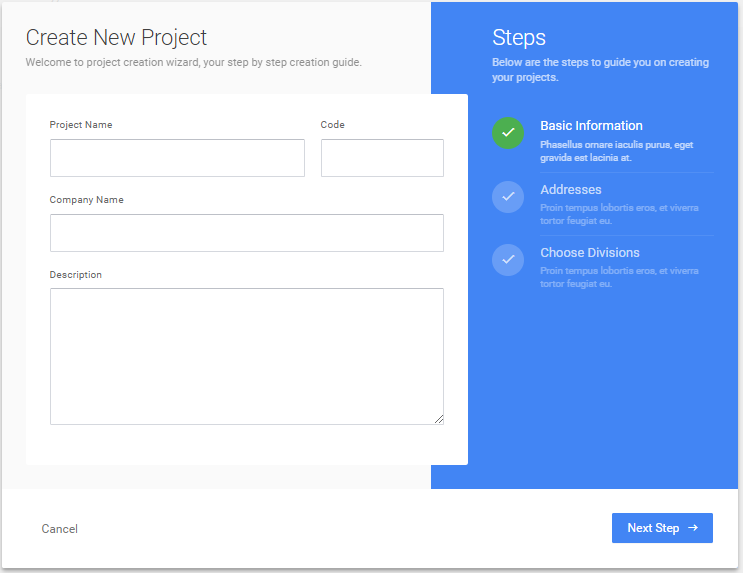
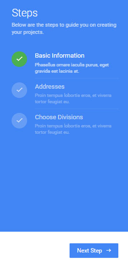
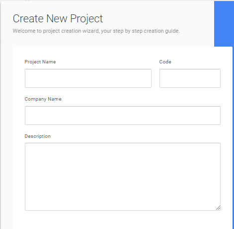
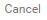
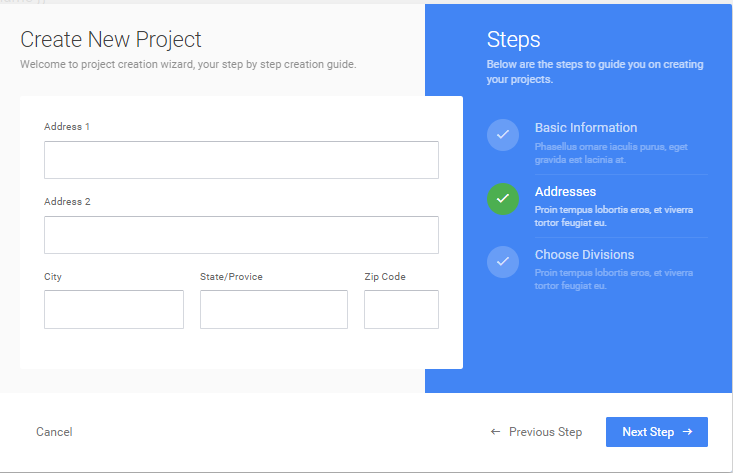
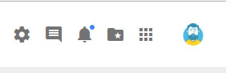

# Project Management

## <ins>Dashboard</ins>

The <b>dashboard</b> serves as the `homepage` in the `AC Tajanlangit System`. This is where you will be able to view all the listed functions for the development of a project. 

Here are the different sections in the application:

### I. Header Section

The header section is located at the top most of the dashboard. It contains the <strong>`ACT logo`</strong> on the left side of the header, the <strong>`Project Name`</strong> at the center of the header and the <strong>`Icon Controllers`</strong> on the right side of the header.

<strong>`Project Name`</strong> - the project name will change if the user have switched to a different project or if the user had created a new project.

<strong>`Icon Controllers`</strong> - there are six icons with different options in the application. These are the following:

- General Settings - 

- Chat / ToDo / System Settings - 

- Notifications - 

- Switch Project / Create a new Project - 

- Resources - 

- Profile - 

### II. Menu Bar

The `menu bar` is located at the left most part of the dashboard under the `ACT logo`. By clicking on the `menu buttons` in the `menu bar` you will be able to view the different features for a project development using the `AC Tajanlangit System`.

<table>
    <tr>
        <th>Controls</th>
        <th>Menu bar Functionality</th>
    </tr>
    <tr>
        <td width="200px"></td>
        <td>
        <strong>Material Scheduler</strong> - view details of material scope and schedules, approve material scope and schedule and view list of historical changes of material scope and schedule.    
        <strong>Purchase Requests</strong> - view list of manual purchase request, search for manual purchase request, sort and filter for manual purchase request, approve manual purchase request, create manual purchase request and view list of historical changes of purchase request.   
        <strong>Purchase Orders</strong> -approve purchase order, view list of approved purchase order, search for purchase order, sort and filter purchase order, view details of purchase order, view list of historical changes of urchase order, view cost monitor in purchase order page, view cost monitor in service purchase order page  
        <strong>Job Orders</strong> - create job orders, view list of job orders.   
        <strong>Service Purchase Orders</strong> -   
        <strong>Billings</strong> - create billing for accounting and list of billings   
        <strong>Vendors</strong> - add a vendor, view list of vendors, update vendor record   
        <strong>Settings</strong> - 
        </td>
    </tr>
</table>

### III. Content Section

The content section is the interactive page of the application. It lets the user view the content of each command selected from the `menu bar` and the `icon controller`. It is where most of the development of a project is worked on. 

## <ins>Creating a Project - Admin Role</ins>

Once planning of a project is complete, the assigned `admin` will begin to create a project using the `AC Tajanlangit System` to put in to details the project. In creating a project in the application, the user is required to be assigned under an <b>`admin role`</b>, if the user is not assigned as an admin, the user is unable to create a new project.

To be assigned to an `admin role`, contact your appointed admin in order to get credentials for an `admin role`.

In this section we will start to create a new project as an `admin` using the `AC Tajanlangit System`. In creating a project there are two scenarios, First scenario is `creating a project for the first time` and the second scenario is `creating a project with an existing project`. 

### <strong>I. Creating your first Project</strong>

If this is the first time a project is to be created this would be the steps in creating a new project.

- After you log in using an <strong>`admin role`</strong> credential a pop up window will appear. The pop up window is labeled as `Create New Project`.

The `Create New Project` have three steps in order to successfully create a new project. 

<table border="0">
    <tr>
          <td>
            
        </td>
        <td>1. Fill in <strong>Basic information</strong> 
            2. Fill in the <strong>Adressess</strong> 
            3. <strong>Choose Divisions</strong> 
        </td>
    </tr>
</table>

1. `Fill in Basic Information` - details of the project will be required to be filled in to better understand the nature of the project. Type in the following information:

<table width="700px">
    <tr>
        <td width="550px">
            
        </td>
        <td width="400px"><strong>Project Name</strong> - this is where the name of the project will be set.    
        <strong>Code</strong> - this is the unique identifier of the project, the code can be alphanumeric. It depends on the required `id code` by management per project.   
        <strong>Company Name</strong> - this is where the name of the company of the project will be set.    
        <strong>Description</strong> - this is where the description of the project will be set.
        </td>
    </tr>
</table>

- After you have filled in the information for each category you may click on the button `Next Step ->`  to proceed to the next page. But if you decide to cancel in creating a new project, click on the `cancel button`  to go back to the `log in` page.

Clicking on the `Next Step ->` button  lets you enter the next page which is the  `Addresses`.

2. Fill in the `Addresses` - these are required information for the company addresses of the project. 

### <strong>II. Creating a project with an existing project</strong>

- On the upper right hand corner of the dashboard, you will see 6 different icons.

- To create a new project click the folder icon  that serves as the <b>`Create Project / Switch Project`</b>  on the upper right part of the dashboard.

- Once you have clicked on the `folder icon` you will see an opened window with the label `switch project`

- On that `switch project` window there is a button labeled as `create project`. Click on the `create project` button to start a new project.

- Details of the project will be required to be filled in to better understand the nature of the project. Type in the following information of the project:

    - 

### Switching between Projects - All Users 

### Assigning users to Projects - Admin Role

### Assigning divisions to Projects - Admin Role

