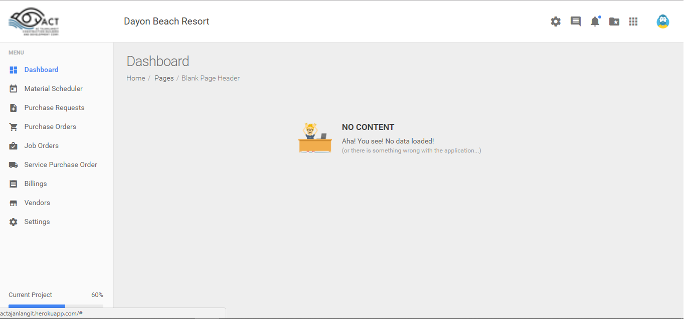
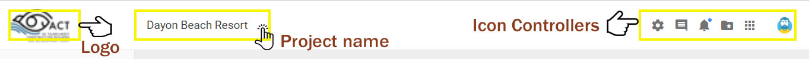
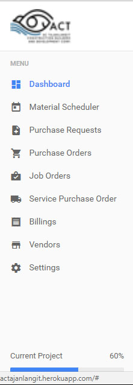
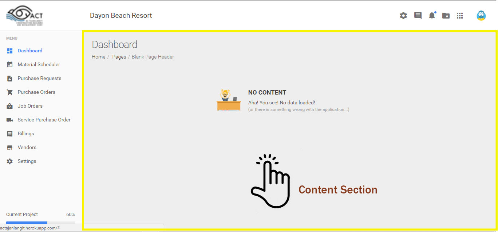
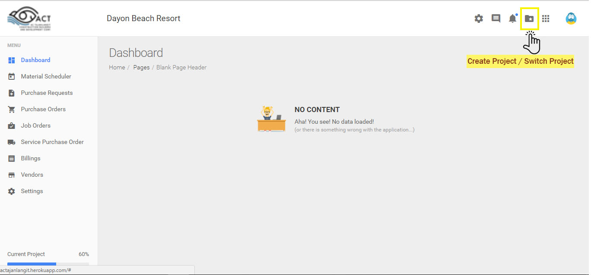

# Project Management

## <ins>Dashboard</ins>

Once you have successfully logged in to the `AC Tajanlangit System` you will be able to view the <b>dashboard</b>. 

The <b>dashboard</b> serves as the `homepage` in the `AC Tajanlangit System`. This is where you will be able to view all the listed functions for the development of a project. 

Here are the different sections in the application:

### I. Header Section

The header section is located at the top most of the dashboard. It contains the <strong>`ACT logo`</strong> on the left side of the header, the <strong>`Project Name`</strong> at the center of the header and the <strong>`Icon Controllers`</strong> on the right side of the header.

<strong>`Project Name`</strong> - the project name will change if the user have switched to a different project or if the user had created a new project.

<strong>`Icon Controllers`</strong> - there are six icons with different options in the application. These are the following:

- Settings

- Chat / Messenger

- Notifications

- Switch Project / Create a new Project

- Resources

- Profile

### II. Menu Bar

The `menu bar` is located at the left most part of the dashboard under the `ACT logo`. It is where you will be able to view the list of features for the project development.

<table>
    <tr>
        <th>Controls</th>
        <th>Menu bar Functionality</th>
    </tr>
    <tr>
        <td width="200px"></td>
        <td>
        <strong>Material Scheduler</strong> - view details of material scope and schedules, approve material scope and schedule and view list of historical changes of material scope and schedule.    
        <strong>Purchase Requests</strong> - view list of manual purchase request, search for manual purchase request, sort and filter for manual purchase request, approve manual purchase request, create manual purchase request and view list of historical changes of purchase request.   
        <strong>Purchase Orders</strong> -approve purchase order, view list of approved purchase order, search for purchase order, sort and filter purchase order, view details of purchase order, view list of historical changes of urchase order, view cost monitor in purchase order page, view cost monitor in service purchase order page  
        <strong>Job Orders</strong> - create job orders, view list of job orders.   
        <strong>Billings</strong> - create billing for accounting and list of billings   
        <strong>Vendors</strong> - view list of vendors, update vendor record
        </td>
    </tr>
</table>

### II. Content Section

The content section is the interactive page of the application. It lets the user view the content of each command selected from the `menu bar` and the `icon controller`. 

## <ins>Creating a Project - Admin Role</ins>

Once planning of a project is complete, the assigned `admin` will begin to create a project. In creating a project in the application, the user is required to be assigned under an <b>`admin role`</b>.

In this section we will start to create a new project using the `AC Tajanlangit System`.

- On the upper right hand corner of the dashboard, you will see 6 different icons. 

- Click the <b>`Create Project / Switch Project icon`</b>  on the upper right part of the dashboard to `create a new project`. The icon looks like an unopened folder with a star character inside the folder.

### Switching between Projects - All Users 

### Assigning users to Projects - Admin Role

### Assigning divisions to Projects - Admin Role

