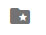

# Project Management

## Dashboard

The <b>dashboard</b> serves as the <b>homepage</b> in the <strong>AC Tajanlangit System</strong>. This is where you will be able to view all the listed functions for the development of a project.

Here are the different sections in the application:

### I. Header Section

The header section is located at the top most of the dashboard. It contains the <strong>ACT logo</strong> on the left side of the header, the <strong>Project Name</strong> at the center of the header and the <strong>Icon Controllers</strong> on the right side of the header.

<strong>Project Name</strong> - the project name will change if the user have switched to a different project or if the user had created a new project.

<strong>Icon Controllers</strong> - there are six icons with different options in the application. These are the following:

- General Settings - 
- Chat / ToDo / System Settings - 
- Notifications - 
- Switch Project / Create a new Project - 
- Resources - 
- Profile - 

### II. Menu Bar

The <b>menu bar</b> is located at the left most part of the dashboard under the <b>ACT logo</b>. By clicking on the <b>menu buttons</b> in the <b>menu bar</b> you will be able to view the different features for a project development using the <strong>AC Tajanlangit System</strong>.

<table>
    <tr>
        <th>Controls</th>
        <th>Menu bar Functionality</th>
    </tr>
    <tr>
        

        <td width="350px"></td>
        <td width="350px">
        <strong>Material Scheduler</strong> - view details of material scope and schedules, approve material scope and schedule and view list of historical changes of material scope and schedule.    
        <strong>Purchase Requests</strong> - view list of manual purchase request, search for manual purchase request, sort and filter for manual purchase request, approve manual purchase request, create manual purchase request and view list of historical changes of purchase request.   
        <strong>Purchase Orders</strong> -approve purchase order, view list of approved purchase order, search for purchase order, sort and filter purchase order, view details of purchase order, view list of historical changes of urchase order, view cost monitor in purchase order page, view cost monitor in service purchase order page  
        <strong>Job Orders</strong> - create job orders, view list of job orders.   
        <strong>Service Purchase Orders</strong> -   
        <strong>Billings</strong> - create billing for accounting and list of billings   
        <strong>Vendors</strong> - add a vendor, view list of vendors, update vendor record   
        <strong>Project Settings</strong> - edit project information, upload material schedule, add divisions to project, edit access list of users to access the project. 
        </td>
        

    </tr>
</table>

### III. Content Section

The content section is the <b>interactive page</b> of the application. It lets the user view the content of each command selected from the <b>menu bar</b> and the <b>icon controller</b>. It is where most of the development of a project is worked on. 

## Creating a Project - Admin Role

Once planning of a project is complete, the assigned <b>admin</b> will begin to create a project using the <strong>AC Tajanlangit System</strong> to put in to details the project. In creating a project in the application, the user is required to be assigned under an <b>admin role</b>, if the user is not assigned as an admin, the user is unable to create a new project.

To be assigned to an <b>admin role</b>, contact your appointed admin in order to get credentials for an <b>admin role</b>.

In this section we will start to create a new project as an <b>admin</b> using the <strong>AC Tajanlangit System</strong>. In creating a project there are two scenarios, First scenario is <b>creating a project for the first time</b> and the second scenario is <b>creating a project with an existing project</b>. 

### <strong>I. Creating your first Project</strong>

If this is the first time a project is to be created this would be the steps in creating a new project.

- After you log in using an <strong>admin role</strong> credential a pop up window will appear. The pop up window is labeled as <b>Create New Project</b>.

The <b>Create New Project</b> has three steps in order to successfully create a new project. 

<table border="0">
    <tr>
          <td>
            
        </td>
        <td>
            

            1. Fill in <strong>Basic information</strong> 
            2. Fill in the <strong>Adressess</strong> 
            3. <strong>Choose Divisions</strong> 
            

        </td>
    </tr>
</table>

### Step 1. <b>Fill in Basic Information</b>

The details of the project will be required to be filled in to better understand the nature of the project. Type in the following information:

<table width="700px">
    <tr>
        <td width="700px">
            
        </td>
        

        <td width="400px">
        <strong>Project Name</strong> - this is where the name of the project will be set.    
        <strong>Code</strong> - this is the unique identifier of the project, the code can be alphanumeric. It depends on the required `id code` by management per project.   
        <strong>Company Name</strong> - this is where the name of the company of the project will be set.    
        <strong>Description</strong> - this is where the description of the project will be set.
        

        </td>
    </tr>
</table>

- After you have filled in the information for each category you may click on the button <b>Next Step -></b>  to proceed to the next page. But if you decide to cancel in creating a new project, click on the <b>cancel button</b>  to go back to the <b>log in</b> page.

Clicking on the <b>Next Step -></b> button  lets you enter the next page which is the  <b>Addresses</b>.

### Step 2. Fill in the <b>Addresses</b>

These are required information for the company addresses of the project. You have to make sure that all information are filled in to have a better analysis on the project's data. 

Once you are done filling in the data for the <b>Addresses</b> you may click on the <b>Next Step-></b>  button to proceed to the next page but if you want to go back to the first step: <b>Basic Information</b> click on the <b><-Previous Step</b> button . 

And If you want to go back to the log in screen you may click on the  <b>cancel button</b>  to go back to the <b>log in</b> page.

### Step 3. Choose <b>Divisions</b>

The last step in creating a new project is to select the <strong>divisions</strong> involved in the project. You may select multiple divisions.

After you have selected the divisions involved in the project you may click the <strong>Done & Save it</strong> button in order to complete the setup of the new project, but if you wish to go back to the <strong>Addresses</strong> page you may click on the <b><-Previous Step</b> button  to return to the previous page.

And if you want to go back to the log in screen you may click the <b>cancel button</b>  to go back to the <b>log in</b> page.

### <strong>II. Creating a project with an existing project</strong>

On the upper right hand corner of the dashboard, you will see 6 different icons.

To create a new project click the folder icon  that serves as the <strong>Create Project / Switch Project</strong>  on the upper right part of the dashboard.

Once you have clicked on the <b>folder icon</b> you will see an opened window with the label <b>switch project</b>

On that <b>switch project</b> window there is a button labeled as <b>create project</b>. Click on the <b>create project</b> button to start a new project.

Details of the project will be required to be filled in to better understand the nature of the project. There are 3 steps to complete in order to successfully create a new project.

### Step 1. <b>Fill in Basic Information</b>

The details of the project will be required to be filled in to better understand the nature of the project. Type in the following information:

<table width="700px">
    <tr>
        <td width="700px">
            
        </td>
        <td width="400px">
        

        <strong>Project Name</strong> - this is where the name of the project will be set.    
        <strong>Code</strong> - this is the unique identifier of the project, the code can be alphanumeric. It depends on the required `id code` by management per project.   
        <strong>Company Name</strong> - this is where the name of the company of the project will be set.    
        <strong>Description</strong> - this is where the description of the project will be set.
        
   
        </td>
    </tr>
</table>

- After you have filled in the information for each category you may click on the button <b>Next Step -></b>  to proceed to the next page. But if you decide to cancel in creating a new project, click on the <b>cancel button</b>  to go back to the <b>log in</b> page.

Clicking on the <b>Next Step -></b> button  lets you enter the next page which is the  <b>Addresses</b>.

### Step 2. Fill in the <b>Addresses</b>

These are required information for the company addresses of the project. You have to make sure that all information are filled in to have a better analysis on the project's data. 

Once you are done filling in the data for the <b>Addresses</b> you may click on the <b>Next Step-></b>  button to proceed to the next page but if you want to go back to the first step: <b>Basic Information</b> click on the <b><-Previous Step</b> button . 

And If you want to go back to the log in screen you may click on the  <b>cancel button</b>  to go back to the <b>log in</b> page.

### Step 3. Choose <b>Divisions</b>

The last step in creating a new project is to select the <strong>divisions</strong> involved in the project. You may select multiple divisions.

After you have selected the divisions involved in the project you may click the <strong>Done & Save it</strong> button in order to complete the setup of the new project, but if you wish to go back to the <strong>Addresses</strong> page you may click on the <b><-Previous Step</b> button  to return to the previous page.

And if you want to go back to the log in screen you may click the <b>cancel button</b>  to go back to the <b>log in</b> page.

## Switching between Projects - All Users 

The <strong>AC Tajanlangit System</strong> can contain multiple projects. In the application you can be able to switch between projects. 

In order to switch between projects, you have to be logged in to view the <strong>dashboard</strong> of the application. 

Once you are in the dashboard click on the <strong>folder icon</strong>  located at the top right of the <strong>dashboard</strong>.

Once you have clicked on the <b>folder icon</b> you will see an new window with the label <b>Switch Projects</b>. 

Select a project below the search box of the Switch Projects window. Use the scrollbar on the right to scroll down to view more projects. 

Once you have selected a different project, you will return to the dashboard of the application. 

The <strong>Project name</strong> on the <strong>header section</strong> will change to the name of the project you have selected. You have now successfully switched between projects.

## Assigning users to Projects - Admin Role

In a project the assigned <b>admin</b> can be able to assign users who will have access to a project in the application. <b>Assigning Users to Projects</b> can only be done by an <b>admin role</b>.

To begin assigning users to a project, log in as an <b>admin</b> in the <strong>AC Tajanlangit System</strong> to view the <b>dashboard</b>. 

Locate the menu bar on the left side of the dashboard. Then, click on the settings button. 

Once the settings button is selected, the <strong>Project Settings</strong> page will appear on the <b>content section</b> of the dashboard. 

The <b>Project Settings</b> page is divided into two sections: <b>Access List of Users</b> and the <b>Navigation Tool.</b>

 <b>Navigation Tool</b>

- Project Information - Configure project's basic information.   

- Material Schedule - Upload csv file exported from Primavera.

- Divisions - Manage Divisions for a project.

- Access List - Grant users access to project.

<b>Access List of Users</b> 

- Complete name of all registered users in the application.

- Email Address of all users

In the Project Settings page, select <strong>Access List</strong> on the left side of the page.

In order to assign a user to a project, check the checkbox beside the name of the user. The checkbox will be marked with a checkmark to signify that a user is selected. Once selected it will automatically be saved. 

## Assigning divisions to Projects - Admin Role

Assigning divisions to Projects requires the user to be logged in as an <b>admin</b>.

Log in as an <b>admin</b> in the <strong>AC Tajanlangit System</strong>.

Locate the menu bar on the left side of the dashboard. Then, click on the settings button. 

Once the settings button is selected, the Project Settings page will appear on the <b>content section</b> of the dashboard. 

In the Project Settings page , select <b>Divisions</b> using the <b>Navigation Tools</b> on the left side of the <b>Project Settings</b> page. 

The <strong>Division Management</strong> contains list of all divisions in the application. Select a division by checking on the checkbox beside the <b>division name</b>.

Once clicking on the checkbox, it will be marked with a checkmark to indicate that a division is selected. Any changes to the <strong>Division Management</strong> will automatically be saved. 

